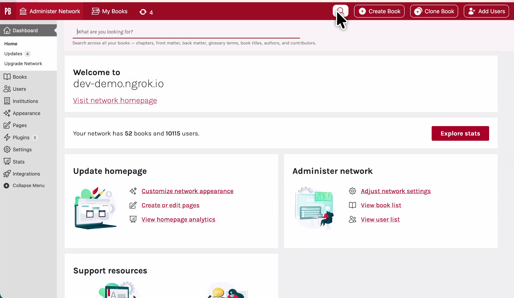
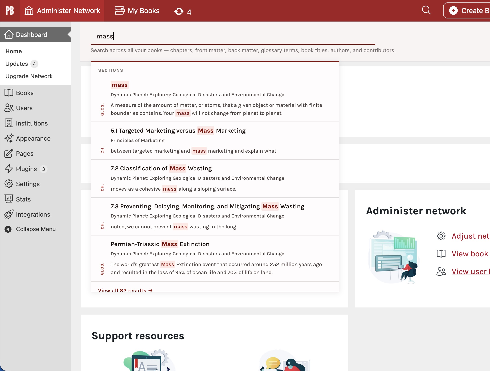
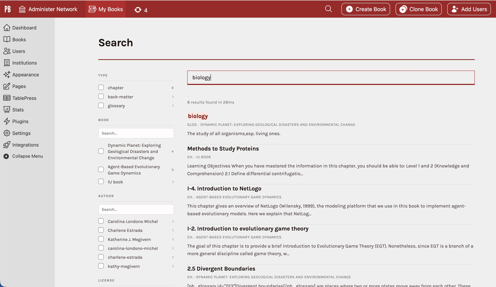

# Pressbooks Beacon

**Contributors:** arzola
**Tags:** pressbooks, search, typesense, faceted-search
**Requires at least:** 6.9
**Tested up to:** 6.9
**Requires PHP:** 8.3
**License:** GPLv3 or later
**License URI:** https://www.gnu.org/licenses/gpl-3.0.html

Fast, faceted search for Pressbooks multisite networks powered by [Typesense](https://typesense.org).

## Description

Pressbooks Beacon adds instant, faceted search across all books in a Pressbooks multisite network. It indexes full chapter text, book metadata, and contributors into Typesense and provides a search UI in the WordPress admin bar.

### Why Beacon?

- **Typo-tolerant** — Built on Typesense's typo-tolerance engine. Misspell a word and still get relevant results. "ecology" matches "ecologi", "ecolgy", even "ecologii".
- **Combined search** — Search by any combination of terms: a topic + an author name, a book title + a license type, a keyword + a contributor. Results are ranked by relevance across all your books at once.
- **Instant results** — Sub-50ms search responses. Results appear as you type, grouped by sections, books, and contributors.
- **Faceted filtering** — Narrow results by post type, book, author, license, or language with one click.
- **Zero config search** — Content is indexed automatically as you edit. No manual reindexing needed (though full reindex is available via CLI).

### Example



### Autocomplete



### All results page



### What gets indexed

| Collection | Contents | Facets |
|---|---|---|
| `pb_sections` | Chapters, front matter, back matter, glossary entries | post type, book, authors, license, language |
| `pb_books` | Book-level metadata (title, authors, subjects, keywords) | authors, language, license, subjects, public/private |
| `pb_contributors` | Contributor taxonomy terms (authors, editors, illustrators, etc.) | contributor type, blog IDs |

### Features

- **Admin bar search** — magnifying glass icon in the admin bar; click to expand an animated search bar with instant results
- **Search results page** — full faceted search with filters for post type, book, author, and license
- **3 visual themes** — Scholarly (warm paper, serif, burgundy), Modern (crisp, sans-serif, cool neutrals), Pressbooks (matches PB admin red, Karla font)
- **Skeleton loading** — animated shimmer placeholders while results load
- **Real-time indexing** — content is re-indexed automatically when posts are saved, deleted, or contributors are modified
- **WP-CLI commands** — full control over collections and indexing from the command line
- **Extensible** — collections, filters, and UI are all hookable via WordPress filters

## Installation

### Requirements

- Pressbooks 6.8+ (multisite)
- PHP 8.3+
- Node 22+
- A running Typesense instance (self-hosted or Typesense Cloud)

### Production

1. Install Typesense — see [typesense.org/docs/guide](https://typesense.org/docs/guide/) for self-hosted or cloud options
2. Install the plugin:
   ```bash
   composer require pressbooks/pressbooks-beacon
   ```
3. Network-activate the plugin
4. Generate a search-only API key from your admin key:
   ```bash
   curl -H "X-TYPESENSE-API-KEY: YOUR_ADMIN_KEY" \
     -X POST \
     -H "Content-Type: application/json" \
     -d '{"description": "Beacon search-only key", "actions": ["documents:search"], "collections": ["*"]}' \
     http://localhost:8108/keys
   ```
   Copy the `value` from the response — this is your **Search API Key**.
5. Go to **Network Admin → Settings → Beacon Search**
6. Enter your Typesense connection details:
   - **Nodes** — comma-separated `host:port:protocol` (e.g. `typesense.example.com:443:https`)
   - **Admin API Key** — a key with full admin access (used for indexing, creating collections)
   - **Search API Key** — the search-only key you generated above (used as the parent for scoped key derivation)
7. Click **Reset Collections** to create the Typesense collections
8. Click **Reindex All Books** to queue indexing jobs
9. Run the job processor (see below)

### Local Development (Lando)

1. Install the [Typesense Lando plugin](https://github.com/typesense/typesense-lando-plugin):
   ```bash
   lando plugin-add https://github.com/typesense/typesense-lando-plugin
   ```

2. Add Typesense to your `.lando.yml`:
   ```yaml
   services:
     typesense:
       type: typesense:27.1
       portforward: 8108
       apiKey: pb-dev-admin-key
   ```

3. Rebuild Lando:
   ```bash
   lando rebuild -y
   ```

4. Verify Typesense is running:
   ```bash
   curl http://localhost:8108/health
   ```

5. Clone and set up the plugin:
   ```bash
   cd web/app/plugins
   git clone https://github.com/pressbooks/pressbooks-beacon.git
   cd pressbooks-beacon
   npm install
   composer install
   npm run build
   lando composer dump-autoload
   ```

6. Network-activate the plugin, then go to **Network Admin → Settings → Beacon Search** and configure:
   - **Nodes**: `localhost:8108:http`
    - **Admin API Key**: `pb-dev-admin-key`
    - **Search API Key**: generate one using the admin key:
      ```bash
      curl -s -H "X-TYPESENSE-API-KEY: pb-dev-admin-key" \
        -X POST -H "Content-Type: application/json" \
        -d '{"description":"Beacon dev search key","actions":["documents:search"],"collections":["*"]}' \
        http://localhost:8108/keys | jq -r '.value'
      ```

7. If you access your site through ngrok or another tunnel, the browser needs a publicly reachable Typesense URL. Start a tunnel:
   ```bash
   ngrok http 8108
   ```
   Then update **Nodes** to your ngrok URL (e.g. `abc123.ngrok-free.app:443:https`).

## Configuration

All settings are at **Network Admin → Settings → Beacon Search**.

| Setting | Description | Default |
|---|---|---|
| Typesense Nodes | Comma-separated `host:port:protocol` | (required) |
| Admin API Key | Typesense key with full access | (required) |
| Search API Key | Parent key for scoped key derivation | (required) |
| Enable in Admin | Show search in WordPress admin | Yes |
| Index Private Books | Index books that are not publicly visible | Yes |
| Index Draft Content | Index draft chapters and sections | No |
| Search Theme | Visual theme for search UI | Scholarly |
| Max Retries | Maximum retry attempts for failed index jobs | 3 |
| Batch Size | Jobs processed per cron run | 50 |

### Visual Themes

| Theme | Description |
|---|---|
| **Scholarly** | Warm paper tones, Literata serif, burgundy accents |
| **Modern** | Crisp neutrals, Source Sans 3, indigo accents |
| **Pressbooks** | Matches PB admin styling, Karla font, PB signature red (#b40026) |

## WP-CLI Commands

```bash
# Reindex a single book
wp beacon reindex <blog_id>

# Reindex all books
wp beacon reindex

# Process queued indexing jobs (run via cron or manually)
wp beacon process-jobs [<limit>]

# Drop and recreate all Typesense collections
wp beacon reset-collections

# Reset collections + clear jobs + queue full reindex
wp beacon reindex-reset

# Check job queue status
wp beacon job-status
```

### Cron setup for job processing

Indexing jobs are processed by WP-Cron. For production, set up a system cron:

```bash
* * * * * cd /var/www/html && wp beacon process-jobs 50 --quiet
```

Or use WP-Cron with a 1-minute interval by ensuring `DISABLE_WP_CRON` is not set.

## Architecture

### Collections Schema

```
pb_sections
├── id            (string)     — composite: "{blog_id}_{post_id}"
├── blog_id       (int64)      — WordPress blog ID (facet)
├── post_id       (int64)      — WordPress post ID
├── post_type     (string)     — chapter | front-matter | back-matter | glossary (facet)
├── post_status   (string)     — publish | private | draft | web-only (facet)
├── title         (string)     — section title
├── content       (string)     — full text content (stripped of HTML)
├── authors       (string[])   — author names (facet)
├── book_title    (string)     — parent book title (facet)
├── book_url      (string)     — permalink to the book
├── edit_url      (string)     — admin edit link
└── updated_at    (int64)      — last modified timestamp (sort)

pb_books
├── id            (string)     — composite: "book_{blog_id}"
├── blog_id       (int64)      — WordPress blog ID (facet)
├── title         (string)     — book title
├── authors       (string[])   — author names (facet)
├── language      (string)     — language code (facet)
├── license       (string)     — license identifier (facet)
├── subjects      (string[])   — subject areas (facet)
├── is_public     (bool)       — public visibility (facet)
└── updated_at    (int64)      — last modified timestamp (sort)

pb_contributors
├── id              (string)   — composite: "contributor_{blog_id}_{term_id}"
├── term_id         (int64)    — WordPress term ID
├── name            (string)   — contributor display name
├── contributor_type(string[]) — author | editor | illustrator etc. (facet)
├── blog_ids        (int64[])  — blogs this contributor appears on (facet)
└── book_count      (int32)    — number of books (sort)
```

### Security: Scoped API Keys

Beacon never exposes the admin API key to the browser. Instead, it derives **scoped API keys** using HMAC:

1. The **search API key** (stored in settings) is the parent key
2. On each page load, a scoped key is generated with embedded `filter_by` rules:
   - **Admin**: `blog_id:=[1,2,5,...]` (only blogs the user has access to)
3. Scoped keys are cached as WordPress transients for 50 minutes
4. The browser receives only the scoped key — it cannot modify the filters

### Real-time Indexing

Content is re-indexed automatically via WordPress hooks:

| Event | Action |
|---|---|
| `save_post` (chapter, FM, BM, glossary) | Upsert section document |
| `delete_post` | Remove section document |
| `wp_initialize_site` | Queue full book reindex |
| `wp_update_site` | Upsert book document |
| `wp_delete_site` | Remove book and its sections |
| `edited_term` / `created_term` (contributor) | Upsert contributor document |
| `delete_term` (contributor) | Remove contributor document |

### Extensibility

```php
// Add custom fields to a collection
add_filter('pb_beacon_collections', function (array $collections) {
    $collections['pb_sections']['fields'][] = [
        'name' => 'custom_field',
        'type' => 'string',
        'optional' => true,
    ];
    return $collections;
});
```

## File Structure

```
pressbooks-beacon/
├── pressbooks-beacon.php          # Plugin entry point
├── composer.json
├── package.json
├── vite.config.js
├── src/
│   ├── Bootstrap.php              # Service registration, hooks, indexing
│   ├── Admin/
│   │   ├── SearchAdmin.php        # Network settings page, AJAX handlers
│   │   ├── SearchBar.php          # Admin bar node, asset enqueueing
│   │   └── SearchHealthCheck.php  # Typesense health check
│   ├── Api/
│   │   └── SearchEndpoint.php    # REST API endpoint
│   ├── Cli/
│   │   └── BeaconCommand.php     # WP-CLI commands
│   ├── Database/
│   │   ├── Migration.php         # Auto-discovers and runs migrations
│   │   └── Migrations/
│   │       └── 000001_create_search_index_jobs_table.php
│   ├── Indexing/
│   │   ├── IndexerInterface.php
│   │   ├── IndexJobProcessor.php  # Queue management, WP-Cron, retries
│   │   └── Indexers/
│   │       ├── BooksIndexer.php
│   │       ├── ContributorsIndexer.php
│   │       └── SectionsIndexer.php
│   ├── Search/
│   │   ├── Collections.php       # Schema definitions
│   │   ├── KeyGenerator.php      # Scoped key derivation
│   │   ├── SearchService.php     # Central coordination
│   │   └── TypesenseClient.php   # PHP client wrapper
│   └── Interfaces/
│       └── MigrationInterface.php
├── assets/
│   ├── beacon.png                # Plugin icon
│   ├── src/
│   │   ├── scripts/
│   │   │   └── pressbooks-beacon.js   # Search UI (Instantsearch.js + Typesense)
│   │   └── styles/
│   │       └── pressbooks-beacon.css  # Themed styles
│   └── dist/                          # Vite build output
├── resources/
│   └── views/
│       ├── admin/settings.blade.php
│       └── search-results.blade.php
└── tests/
    ├── Unit/
    │   ├── CollectionsTest.php
    │   ├── KeyGeneratorTest.php
    │   └── SearchBarTest.php
    └── TestCase.php
```

## Changelog

Please see the [CHANGELOG](CHANGELOG.md) file for more information.
